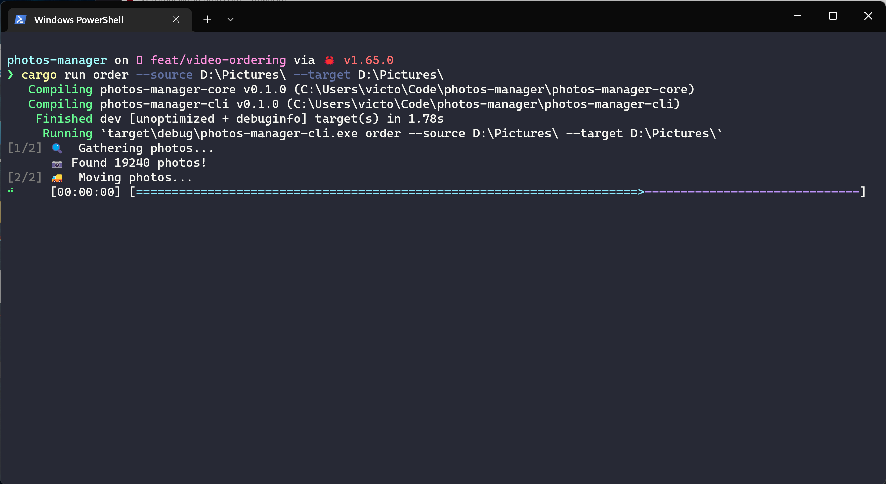

# photos-manager

## Introduction

I have a lot of photos, many of them are duplicated, many live in the same path and they're a
complete mess, whenever I open the photos folder, the explorer takes so much time to index them
all, which is less than ideal.

My main initial goal on this project is to add some utilities for myself to try to order them in
separate folders using a CLI. In the future more utilities will be added, and maybe a GUI will be
added as well.

Having a GUI in the future is the main reason to have two packages, the `cli` which will internally
will call the `core` package, which will have all the business logic which in a possible future will
be used by the GUI.



## Usage

### Order photos by month

Order photos from a given folder by year and month. The command works recursively, so every nested
folder will get accounted for. Every photo will be placed at the root of the target path and
inside folders like `2020-01`.

```bash
photos-manager-cli order --source "./home/user/photos"  --target "./home/user/photos"
```

### Adds white border

Add a white border to a photo or set of photos and choose from `thin`, `medium` or `thick` border.

```bash
# A single photo
photos-manager-cli border --source "./home/user/photos/photo1.jpg"

# Or a set of photos
photos-manager-cli border --source "./home/user/photos"

# And only to the photos starting from some date onwards.
# In this case, all photos from jan 1st 2023.
photos-manager-cli border --source "./home/user/photos" --from "2023-01-01"
```

## Development

### Requirements

- git
- Rust >= 1.64.0
- [`Image Magick`](https://imagemagick.org/script/download.php)

### Run CLI

```bash
cargo run -- --help
cargo run order --help
cargo run border --help
```

#### Windows

Cargo needs a bit of help to know where the `image magick` libraries are. After downloading add a
`.cargo/config.toml` file with the correct path to the libraries

```bash
cp .cargo/config.toml.example .cargo/config.toml
```
